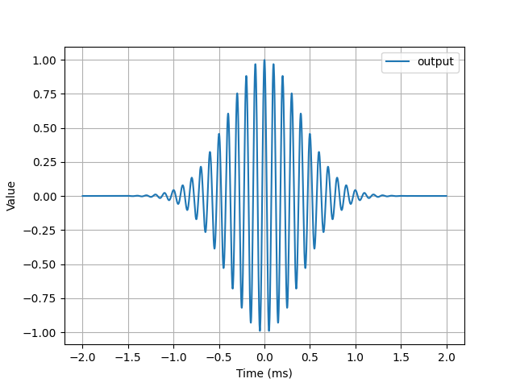

# Range function in C 

You must use the compatible function to the type of your arrays.\
For double arrays:
    
    void DRANGE(double* arr, double start, double end, int step);

For float arrays:
    
    void FRANGE(float* arr, float start, float end, int step);

Your arrays must be the same size as the numbers you generate. **This is really important!**\
For example:
 
    double timeArray[arrLen];
    DRANGE(&timeArray[0], -2.0, 2.0, arrLen);

____
* ##  For test
```sh
$ gcc test.c range.c -o test
$ ./test
$ python3 test_plotter.py
```


___